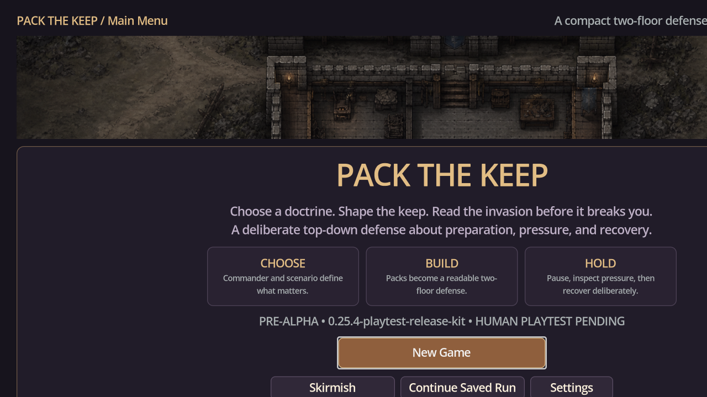
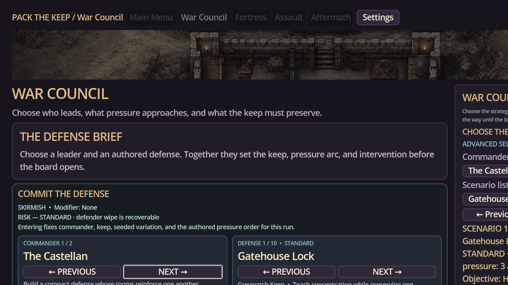

# Pack the Keep — Latest Main Test Report

## Build and verification

| Field | Result |
|---|---|
| Branch tested | `origin/main` |
| Build | `v0.25.4-playtest-release-kit` |
| Engine | Godot 4.4.1 |
| Visual test display | 1280×720 Xvfb display |
| Automated verification | PASS: repository policy, content, P13–P46 progression, event, persistence, controller, and auto-battle suites |
| Runtime smoke | PASS: project launched and advanced from Main Menu into War Council |

## Captured evidence

The screenshots were captured from the actual latest main build and are stored under [`docs/visual_evidence/v0.25.4-playtest-release-kit-latest-test-2026-08-30/`](visual_evidence/v0.25.4-playtest-release-kit-latest-test-2026-08-30/).

## Findings

The latest build has a much stronger authored presentation than the earlier prototype and communicates the CHOOSE, BUILD, and HOLD framing clearly on the title screen. The real flow reaches War Council successfully. The main visible problem at 1280×720 is horizontal overflow: the right-hand selection panel is clipped while the left-side briefing remains readable. The lower menu row is also close to the viewport edge. This makes the preparation decision harder to understand and should be treated as a release-blocking presentation issue for the minimum supported layout.

## Next roadmap steps

### Keep Quality 1 — Responsive War Council and Preparation layout

Create a responsive split-pane contract for 1280×720, 1600×900, and large-text settings. At narrow widths, the inspector must move below the briefing or collapse into a clearly reachable single-column selection flow. The selected commander, scenario, risk, objective, and primary commit action must remain visible together without clipping. Add screenshot assertions for each supported viewport.

### Keep Quality 2 — One unmistakable preparation-to-battle handoff

Ensure the player can see what the chosen commander, keep, pack doctrine, and forecast mean before committing. The first battle should begin with a readable forecast and a clear pause/inspection affordance. Do not add new unit families until this handoff works for a first-time player.

### Keep Quality 3 — Visual combat and recovery evidence

Capture one complete First Watch sequence at 1600×900: War Council, Preparation, paused wave, live impact, inter-wave recovery, next wave, and final Results. Store the sequence under a new versioned directory and keep the existing deterministic seed so screenshot comparisons remain meaningful.

### Keep Quality 4 — Human comprehension and difficulty calibration

Run moderated sessions using the existing P16 protocol. Record where players fail to identify the threat, understand a placement trade-off, notice ammunition or repair limits, or know why a result occurred. Tune only after the evidence is recorded; preserve at least two viable answers for each teaching scenario.

## Evidence interpretation

This report records an internal pre-alpha test. The screenshots demonstrate current implementation progress and are appropriate for a development archive, but they are not final store art or evidence of release readiness.
