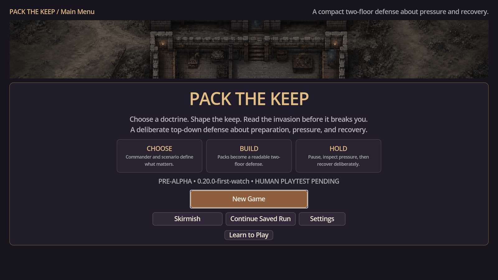
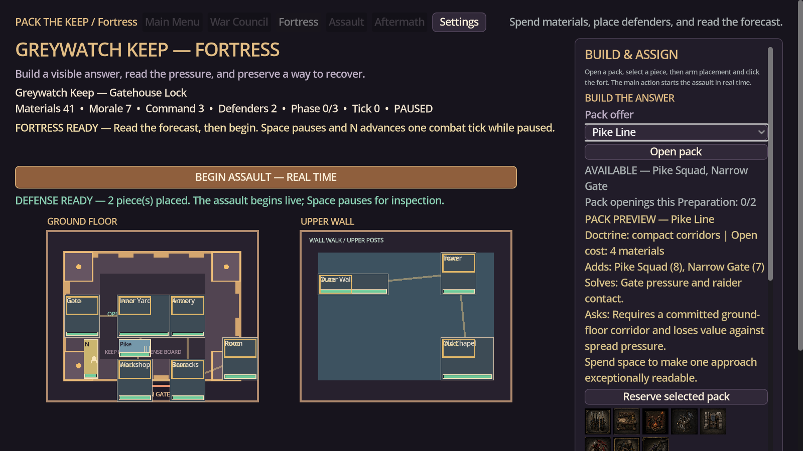
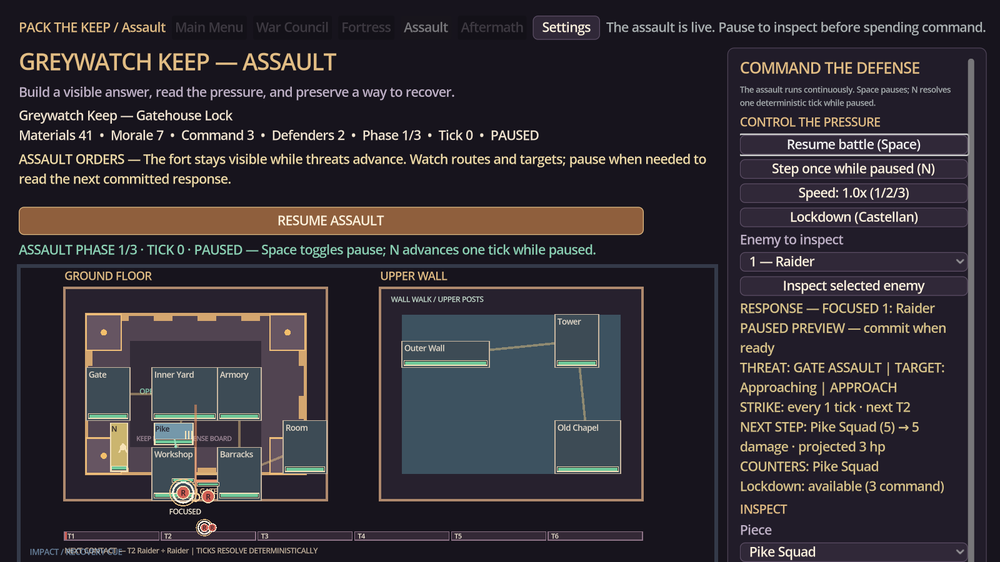
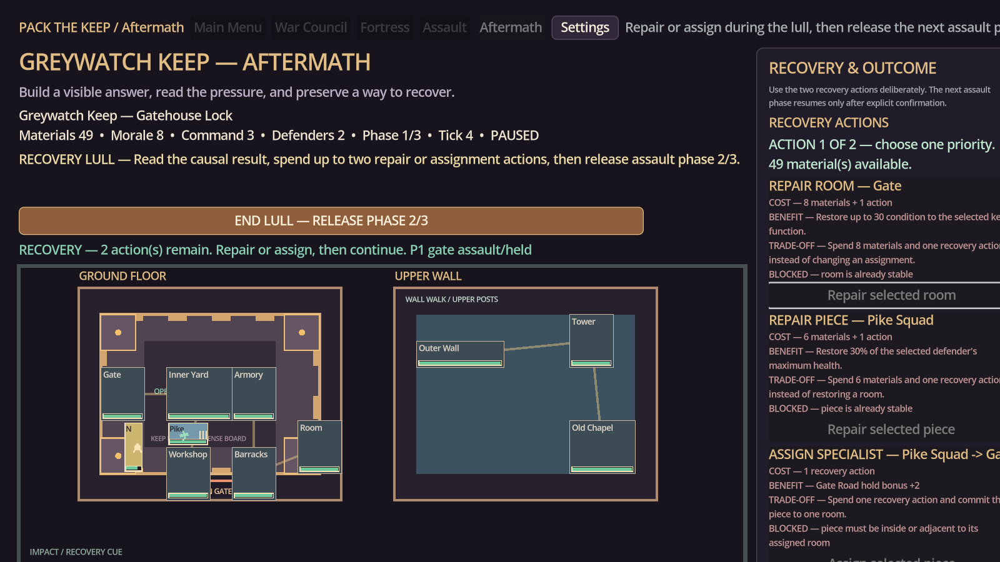
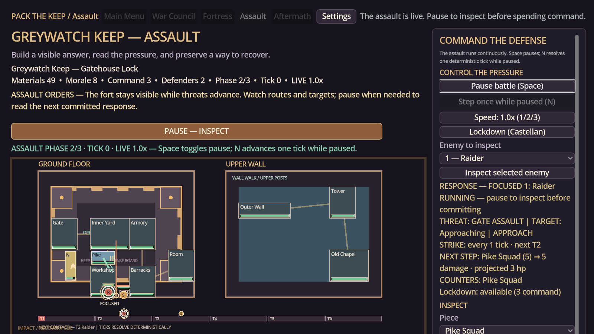
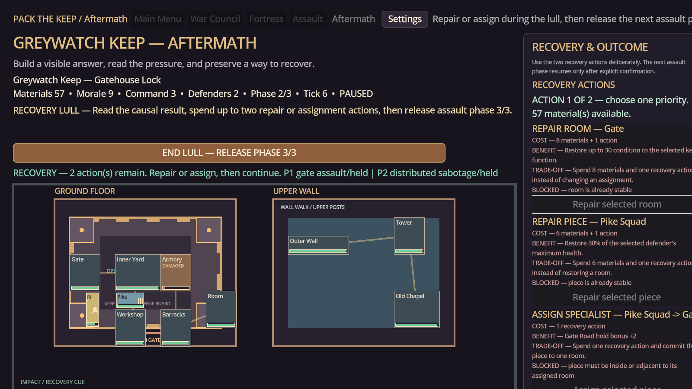
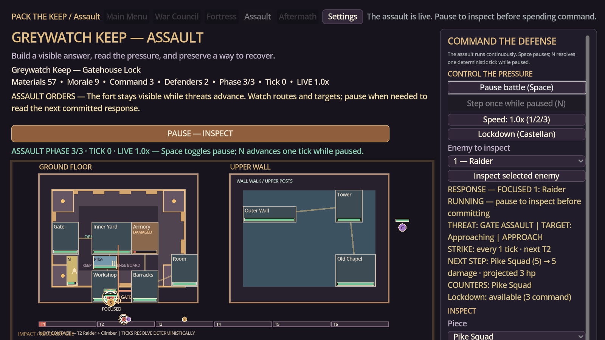
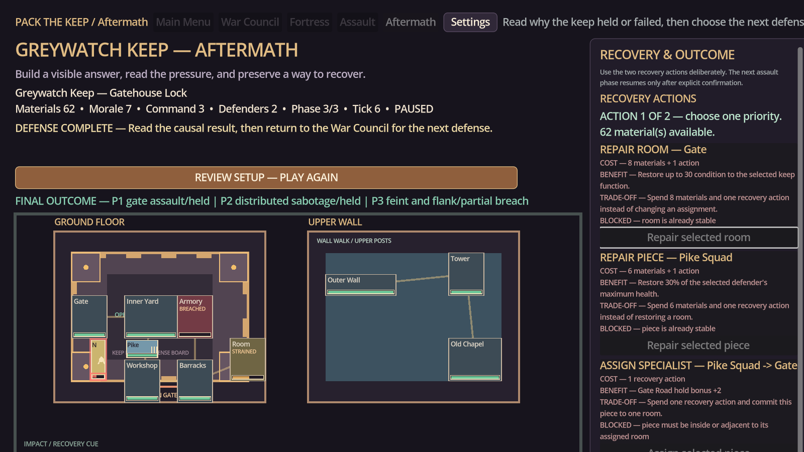

# Pack the Keep — Visual Evidence Gallery

This gallery preserves the strongest screenshots from the `0.20.0-first-watch` development capture set. They document the transition from a functional combat prototype toward a readable, game-quality top-down keep-defense experience. These are internal alpha screenshots, not final store art.

Current builds can regenerate equivalent comparison states with `tools/capture_vertical_slice.gd`. The harness writes nine stable 1600×900 PNG names and a machine-readable manifest to an explicit local directory; generated captures remain untracked unless deliberately curated into this gallery.

## Capture record

| Field | Value |
|---|---|
| Build | `0.20.0-first-watch` |
| Capture set | Latest First Watch and multi-wave combat UI evidence |
| Logical presentation | 1280×720 design canvas with large-text and accessibility coverage |
| Capture scope | Title, Preparation, paused waves, inter-wave results, and final Results |
| Evidence status | Existing internal development screenshots; exact capture timestamp was not preserved |

## Screenshots

### Title

The title presents the commander-and-pack premise and the entry into the First Watch experience.

### Preparation

Preparation shows the top-down keep, placement decisions, and the relationship between spatial arrangement and defensive doctrine.

### Wave 1 paused

The paused combat state demonstrates the intended solo-play rhythm: inspect the threat, understand its path, and choose an intervention.

### Inter-wave Results

The first inter-wave report shows damage, recovery, and the consequences carried into the next assault.

### Wave 2 paused

The second wave demonstrates that the keep is being tested by a continuing sequence rather than a single isolated encounter.

### Inter-wave 2 Results

The second report provides a useful development snapshot for showing how the game explains escalation and recovery.

### Wave 3 paused

The final assault state shows the accumulated pressure on the keep and the importance of preserving a functioning defensive plan.

### Final Results

The final report closes the First Watch battle and provides a natural place to discuss replay, commander identity, and future content.

## Kickstarter bonus-content framing

A Kickstarter campaign could present this set as **“Inside the Keep: From Prototype to First Watch”**. It shows a clear, understandable development story: commander selection, spatial preparation, live auto-battle, pause-and-inspect decisions, recovery, and final debrief.

A suitable bonus could be a digital **Fortress Field Notes** pack containing the versioned screenshots, annotated development commentary, commander doctrine cards, and a short explanation of how the same deterministic battle can be replayed to test a different placement. This is safer and more credible than promising a large list of future units or campaigns.

The reward should be described as an alpha development archive. Do not present placeholder art or prototype UI as final visual quality, and do not imply that a Kickstarter campaign guarantees a particular feature, platform date, or storefront release.
